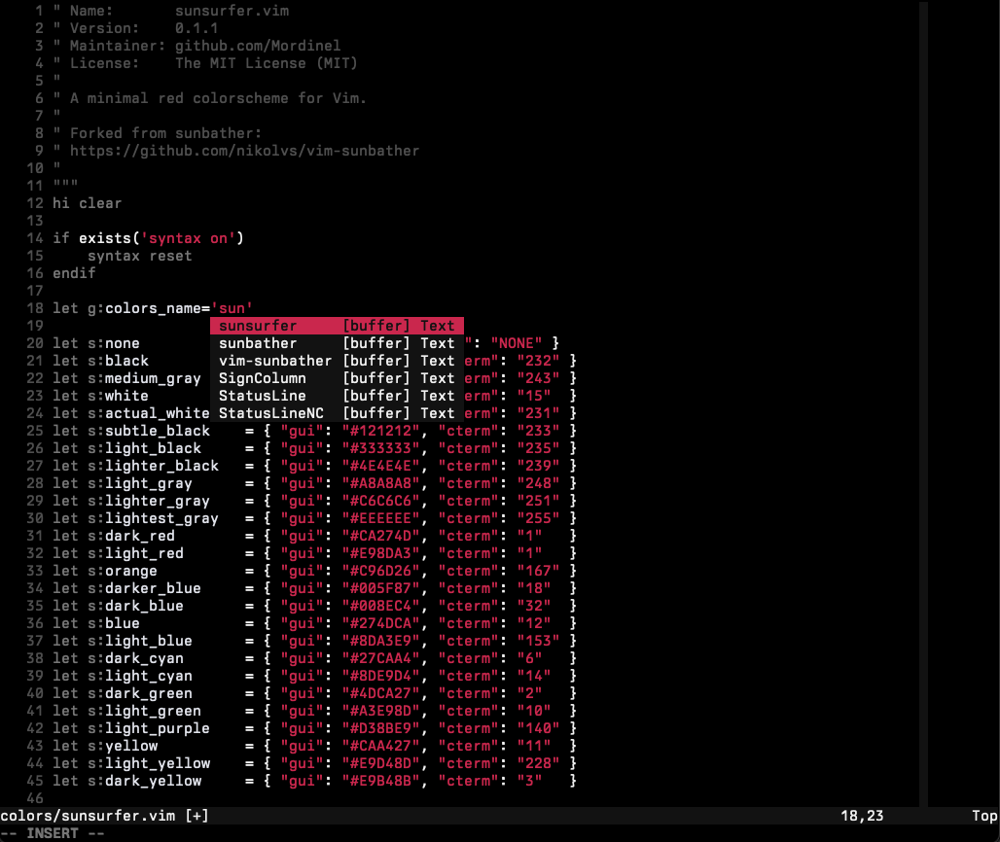

# Sunsurfer

A minimal red colorscheme for Vim.

## Screenshots

*Berkeley Mono* font on dark background:



## Installation

Copy the color scheme file to your `~/.vim/colors` directory, or use a plugin
manager like [packer][] [Plug][] or [Vundle][] and add `"Mordinel/vim-sunsurfer"`
as a plugin.

[packer]: https://github.com/wbthomason/packer.nvim
[vundle]: https://github.com/gmarik/Vundle.vim
[plug]: https://github.com/junegunn/vim-plug

## Usage

```
:colorscheme sunsurfer
```

Supports `background=dark`.

## Credits

Forked from [sunbather][].
Based on the [pencil][], [off][] and [paramount][]colorschemes.

[sunbather]: https://github.com/nikolvs/vim-sunbather
[paramount]: https://github.com/owickstrom/vim-colors-paramount
[pencil]: https://github.com/reedes/vim-colors-pencil
[off]: https://github.com/reedes/vim-colors-off

## Contributions

If you find any problems with this color scheme please post an issue here on
GitHub. If you don't like some specific color, please fork it instead and customize
to your liking. Thanks!

## License

Original license from pencil: [MIT](LICENSE)
